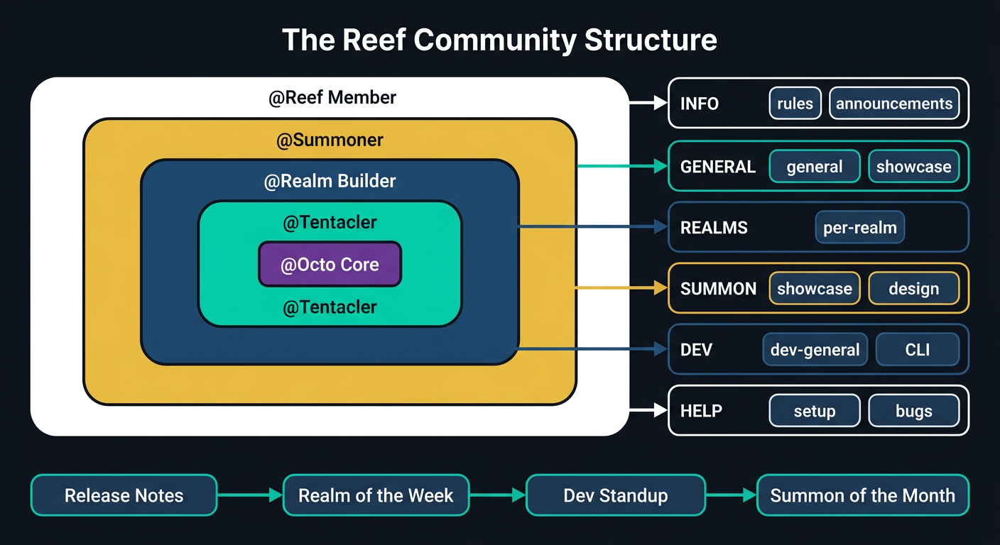

<p align="center">
  <picture>
    <source media="(prefers-color-scheme: light)" srcset="https://raw.githubusercontent.com/open-octopus/openoctopus.club/main/src/assets/brand/logo-dark.png">
    
  </picture>
</p>

<h3 align="center">The Reef</h3>

<p align="center">
  Community policies, governance, and documentation for the OpenOctopus community.
</p>

<p align="center">
  <a href="https://github.com/open-octopus/community/blob/main/LICENSE"></a>
  <a href="#"></a>
  <a href="https://github.com/open-octopus/openoctopus"></a>
  <a href="https://discord.gg/mwNTk8g5fV"></a>
</p>

---

> **Status: Planned** — Part of the OpenOctopus ecosystem roadmap.
> Star this repo to follow progress.

## What is The Reef?

**The Reef** is the official community for [OpenOctopus](https://github.com/open-octopus/openoctopus) — the realm-native life agent system. Named after a coral reef where diverse life thrives together, The Reef is where users, builders, and contributors gather to discuss realms, share summoned entities, build realm packages, and shape the future of AI life management.

This repository contains community policies, governance documents, and operational guides for The Reef.

<p align="center">
  
</p>

## Discord — The Reef

Join us: **[discord.gg/mwNTk8g5fV](https://discord.gg/mwNTk8g5fV)**

### Channel Structure

| Category | Channels | Purpose |
|----------|----------|---------|
| **📋 INFO** | `#start-here`, `#rules`, `#announcements`, `#roadmap` | Orientation, community rules, official updates, development roadmap |
| **💬 GENERAL** | `#general`, `#introductions`, `#showcase`, `#ideas`, `#off-topic` | Daily discussion, self-introductions, project showcases |
| **🌍 REALMS** | `#realm-pet`, `#realm-family`, `#realm-finance`, `#realm-work` | Domain-specific discussions |
| **✨ SUMMON** | `#summon-showcase`, `#entity-design` | Show off summoned entities, discuss SOUL.md design |
| **🛠️ DEV** | `#dev-general`, `#tentacle-cli`, `#contributing` | Developer discussion, CLI tooling, contribution guide |
| **❓ HELP** | `#setup-help`, `#bug-reports`, `#feature-requests` | Support and issue reporting |
| **🔊 VOICE** | `General Voice`, `Dev Standup` | Voice chat and developer standups |

## Community Rules

1. **Be respectful and constructive.** Treat everyone with kindness. No harassment, personal attacks, hate speech, or discrimination.
2. **Keep discussions on-topic.** Use the appropriate channels. Off-topic chat goes in `#off-topic`.
3. **No spam or unsolicited self-promotion.** Share your OpenOctopus projects in `#showcase`. Don't post ads or affiliate links.
4. **No unsolicited DMs.** Don't DM other members without permission. Use public channels first.
5. **Search before asking.** Check `#setup-help` and the docs before posting a new question.
6. **Use English in public channels.** This helps everyone participate in the conversation.
7. **Follow Discord's Terms of Service.** No NSFW, illegal, or pirated content.

Enforcement: friendly reminder → formal warning → temporary timeout → ban.

## Roles

| Role | Color | Description |
|------|-------|-------------|
| `@Octo Core` | Purple (`#6C3FA0`) | Core team members |
| `@Tentacler` | Cyan (`#00D4AA`) | Code contributors (merged PR) |
| `@Realm Builder` | Ocean (`#1E3A5F`) | Realm package contributors |
| `@Summoner` | Gold (`#FFD700`) | Active SOUL.md creators |
| `@Reef Member` | Default | Community members |

### How to Earn Roles

- **Tentacler**: Get a pull request merged in any OpenOctopus repository
- **Realm Builder**: Publish a realm package to [RealmHub](https://github.com/open-octopus/realmhub) or contribute to [realms](https://github.com/open-octopus/realms)
- **Summoner**: Share a creative SOUL.md in [soul-gallery](https://github.com/open-octopus/soul-gallery) or `#summon-showcase`

## Community Events

| Frequency | Event | Channel |
|-----------|-------|---------|
| Every release | Release Notes announcement | `#announcements` |
| Weekly | "Realm of the Week" — best showcase pick | `#showcase` |
| Bi-weekly | Dev Standup voice call (30 min) | `Dev Standup` |
| Monthly | "Summon of the Month" — best entity design | `#summon-showcase` |
| Ad hoc | AMA (Ask Me Anything) sessions | `#general` |

## Getting Started as a Contributor

### Orient and Observe

- [ ] Join [The Reef](https://discord.gg/mwNTk8g5fV) and read pinned messages in `#dev-general`
- [ ] Read the [CONTRIBUTING.md](https://github.com/open-octopus/.github/blob/main/CONTRIBUTING.md) guide
- [ ] Clone the core repo and run `pnpm install && pnpm build && pnpm test:unit`
- [ ] Browse small PRs: filter by `is:open is:pr label:good-first-issue`
- [ ] Read 3-5 recently merged PRs to learn the code style

### Your First Contribution

- [ ] Pick a `good-first-issue` and assign yourself
- [ ] Create a branch (`feat/your-feature` or `fix/your-fix`)
- [ ] Make changes, run `pnpm check && pnpm test:unit`
- [ ] Submit a PR using the [PR template](https://github.com/open-octopus/.github/blob/main/PULL_REQUEST_TEMPLATE.md)
- [ ] Respond to code review feedback

### Build Your Rhythm

- [ ] Graduate to larger issues
- [ ] Contribute a SOUL.md to [soul-gallery](https://github.com/open-octopus/soul-gallery)
- [ ] Design a realm for [realms](https://github.com/open-octopus/realms)
- [ ] Join the bi-weekly Dev Standup voice call

## Do's and Don'ts

### Do

- Run `pnpm check && pnpm test:unit` before every PR
- Use the five core terms in English (Realm, Entity, Summon, Agent, Skill)
- Thank contributors in PR comments
- Ask questions in `#dev-general` before starting large changes
- Follow the existing code patterns — read before writing

### Don't

- Push untested code to main
- Add `@ts-ignore` or `@ts-nocheck`
- Use `any` type in TypeScript
- Merge your own non-trivial PRs without review
- Skip the PR template checklist

## Key Files

| File | Why It Matters |
|------|----------------|
| [`CLAUDE.md`](https://github.com/open-octopus/openoctopus/blob/main/CLAUDE.md) | Tech stack, commands, naming conventions, architecture overview |
| [`CONTRIBUTING.md`](https://github.com/open-octopus/.github/blob/main/CONTRIBUTING.md) | Setup, workflow, code style, terminology |
| [`docs/project-spec.md`](https://github.com/open-octopus/openoctopus/blob/main/docs/project-spec.md) | Product positioning, milestones, RealmHub design |
| [`docs/design-discussion.md`](https://github.com/open-octopus/openoctopus/blob/main/docs/design-discussion.md) | Deep design decisions, naming rationale |
| [`docs/branding.md`](https://github.com/open-octopus/openoctopus/blob/main/docs/branding.md) | Brand identity, color palette, tone of voice |

## Quick Commands

```bash
pnpm build           # Build all packages
pnpm dev             # Dev mode (ink gateway with hot-reload)
pnpm test:unit       # Run unit tests
pnpm typecheck       # TypeScript strict check
pnpm lint            # oxlint
pnpm format          # oxfmt
pnpm check           # typecheck + lint + format
pnpm knip            # Dead code detection
```

## Resources

| Resource | URL |
|----------|-----|
| Core repo | https://github.com/open-octopus/openoctopus |
| Website | https://openoctopus.club |
| Discord (The Reef) | https://discord.gg/mwNTk8g5fV |
| RealmHub | https://github.com/open-octopus/realmhub |
| Soul Gallery | https://github.com/open-octopus/soul-gallery |
| Realm Packages | https://github.com/open-octopus/realms |

## Contact

- **Email**: hello@openoctopus.club
- **Discord**: [discord.gg/mwNTk8g5fV](https://discord.gg/mwNTk8g5fV)
- **X / Twitter**: [@openoctopus](https://x.com/openoctopus)
- **Website**: [openoctopus.club](https://openoctopus.club)

## Related Projects

| Project | Description |
|---------|-------------|
| [openoctopus](https://github.com/open-octopus/openoctopus) | Core monorepo |
| [reef-bot](https://github.com/open-octopus/reef-bot) | Discord community bot |
| [soul-gallery](https://github.com/open-octopus/soul-gallery) | SOUL.md template gallery |
| [realms](https://github.com/open-octopus/realms) | Official realm packages |

## License

[MIT](LICENSE) — see the [.github repo](https://github.com/open-octopus/.github) for the full license text.
